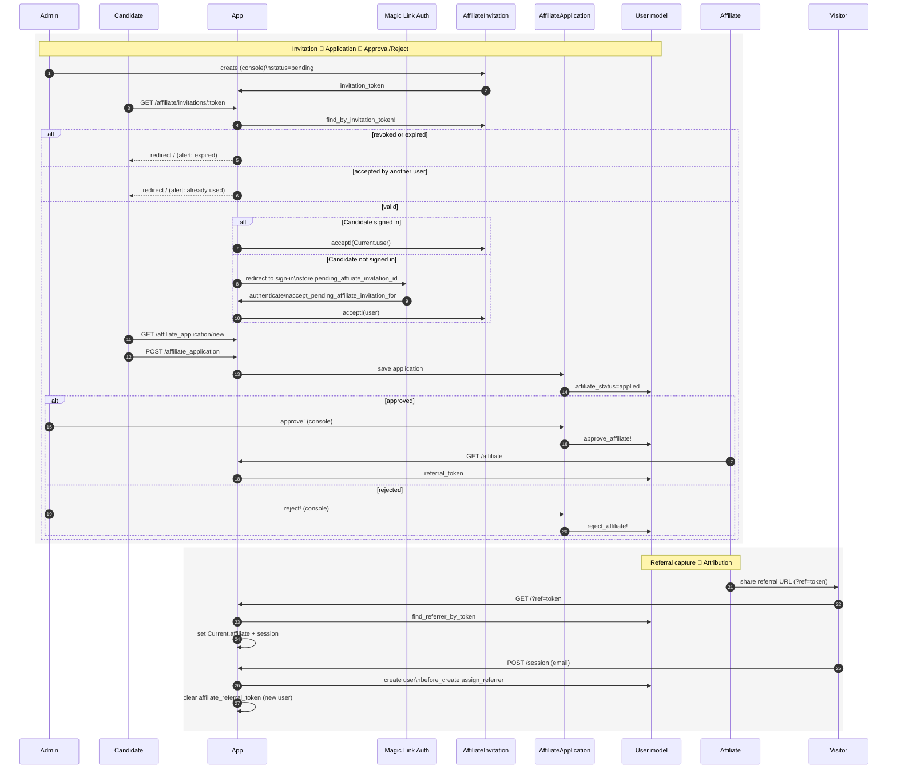

# Affiliate and Referral Lifecycle

```mermaid
sequenceDiagram
  autonumber
  participant Admin
  participant Candidate
  participant App
  participant Auth as Magic Link Auth
  participant Invite as AffiliateInvitation
  participant Apply as AffiliateApplication
  participant User as User model
  participant Affiliate
  participant Visitor

  rect rgb(245,245,245)
  Note over Admin,User: Invitation  Application  Approval/Reject
  Admin->>Invite: create (console)\nstatus=pending
  Invite->>App: invitation_token
  Candidate->>App: GET /affiliate/invitations/:token
  App->>Invite: find_by_invitation_token!
  alt revoked or expired
    App-->>Candidate: redirect / (alert: expired)
  else accepted by another user
    App-->>Candidate: redirect / (alert: already used)
  else valid
    alt Candidate signed in
      App->>Invite: accept!(Current.user)
    else Candidate not signed in
      App->>Auth: redirect to sign-in\nstore pending_affiliate_invitation_id
      Auth->>App: authenticate\naccept_pending_affiliate_invitation_for
      App->>Invite: accept!(user)
    end
    Candidate->>App: GET /affiliate_application/new
    Candidate->>App: POST /affiliate_application
    App->>Apply: save application
    Apply->>User: affiliate_status=applied
    alt approved
      Admin->>Apply: approve! (console)
      Apply->>User: approve_affiliate!
      Affiliate->>App: GET /affiliate
      App->>User: referral_token
    else rejected
      Admin->>Apply: reject! (console)
      Apply->>User: reject_affiliate!
    end
  end
  end

  rect rgb(245,245,245)
  Note over Affiliate,User: Referral capture  Attribution
  Affiliate->>Visitor: share referral URL (?ref=token)
  Visitor->>App: GET /?ref=token
  App->>User: find_referrer_by_token
  App->>App: set Current.affiliate + session
  Visitor->>App: POST /session (email)
  App->>User: create user\nbefore_create assign_referrer
  App->>App: clear affiliate_referral_token (new user)
  end
```
