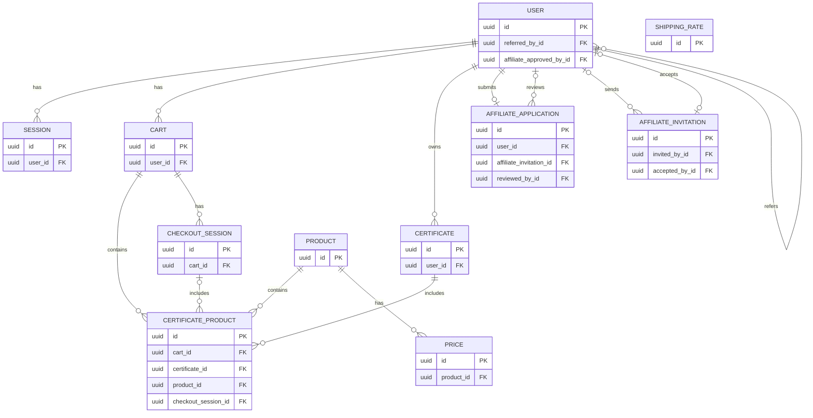

# Data Model

The diagram below shows the relationships among the application's Active Record models.

`ShippingRate` is included as an isolated model because it currently has no Active Record associations.
